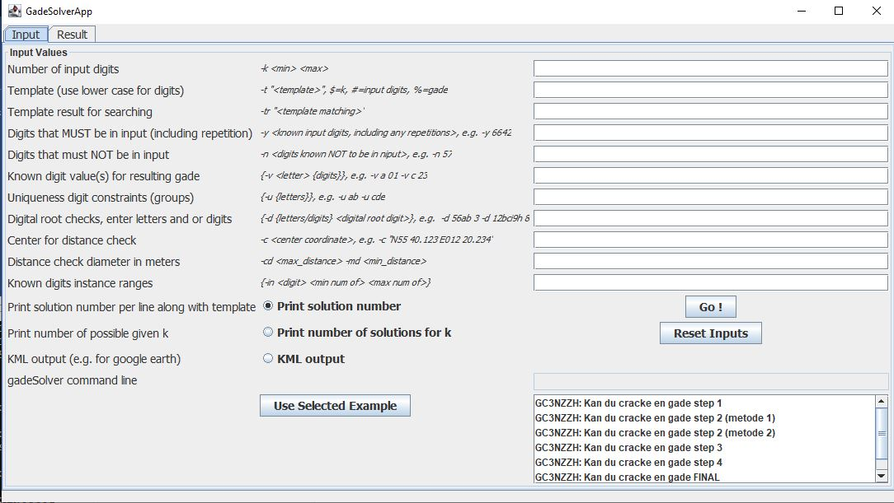

# GadeSolverApp

Welcome to the GadeSolverApp. The objective is to attempt to crack a "Gade" structure as used in geocaching. It is assumed that the user knows about the Gade method. The App works by first generating all possible digit combinations for a given number of input digits (k). The generated combinations are then passed through a number of checks as defined by the user. These include digital roots, partially known inputs, distance function for resulting coordinates, etc. Coordinates that pass all checks are printed as possible solutions. 


## Build

Clone the directory and build the java project using your favorite tool (e.g. Visual Studio code). The result is the jar file `GadeSolverApp.jar`.


## Download directly

Instead of building it yourself, you may download `GadeSolverApp.jar` using this [direct link](https://github.com/jens-markussen/GadeSolverApp/raw/main/GadeSolverApp.jar) from the repository without cloning it. 


## Install Java

To run the App, you must have Java installed locally. Best Free Java environment is probably the one from [Microsoft](https://learn.microsoft.com/en-us/java/openjdk/download). Just get the most recent one. If you are on Windows (most will likely be), just select the MSI package and you're off.


## Running it

To run the App in default (GUI) mode, simply enter below to bring up the main screen.

```
java -jar GadeSolverApp.jar
```

.

The detailed arguments should hopefully be self-explanatory. Again, the error handling non-existant, so get it wrong and you are on your own. Take the opportunity to explore the included examples based on (now gone) cache GC3NZZH "Kan du cracke en gade" by SidseFrank. Simply select one of the examples and press "Use Selected Example".

Press "Go" to start the search for possible solutions. The solutions are returned in the separate "Result" tab and as well written to the standard output. 

The format of the output may be adjusted using the radio buttons (for adding a solution number/index, number of solutions, or alternatively exporting as KML for viewing into e.g. Google Earth).

When pressing "Go", a line is populated with the exact command line arguments. This can be handy for saving the inputs for later as you may pass the arguments into the app as well. To pass arguments directly into the app. To start the app with a set range for `k` (the number of digits in the Gade), do 

```
java -jar GadeSolverApp.jar -k 6 8
```

### Running in non-gui mode

It is possible to run in non-gui mode, simply supplying all arguments directly on the command line and pass as first argument -nogui. You could for example save your examples in a Windows `.bat` file with all the arguments included. 

```
java -jar -nogui GadeSolverApp.jar  -k 15 35 -d 55dmsta 5 -d 12bctfb 4 -v d 2 -v b 1 -v m 678 -v c 012 -c "N55 27.291 E012 11.101" -cd 3000 -t "N55 dm.sta E012 bc.tfb"
```

### See also

[Gade app til felten - ikke cracker](https://play.google.com/store/apps/details?id=org.nolleper.gadedroid&hl=da&gl=US)
[Geowiki beskrivelse af Gade](https://web.archive.org/web/20200918102839/https://geowiki.wegge.dk/wiki/Gade_(beregningsteknik))